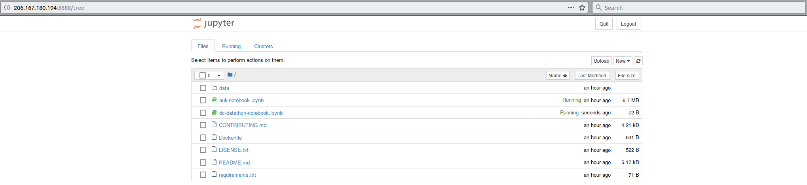

# AU Washington, DC Datathon Notebook

Jupyter notebook to assist in creating additional analysis and visualizations of Archives Unleashed Cloud derivatives as the [Archives Unleashed Washington, DC Datathon](https://archivesunleashed.org/washington/).

The datathon notebook is derived from [Archives Unleashed Cloud: Jupyter Notebooks](https://github.com/archivesunleashed/auk-notebooks).

## Getting Started

- Shell into your assigned datathon VM with the provided key, and IP address:

```
ssh -i ~/.ssh/archives-hackathon.key ubuntu@206.167.180.xx.xx
```

```console
$ ssh -i ~/.ssh/archives-hackathon.key ubuntu@206.167.180.194

Welcome to Ubuntu 18.04.2 LTS (GNU/Linux 4.15.0-46-generic x86_64)

 * Documentation:  https://help.ubuntu.com
 * Management:     https://landscape.canonical.com
 * Support:        https://ubuntu.com/advantage

  System information as of Wed Mar 13 22:07:38 UTC 2019

  System load:  0.03               Processes:           231
  Usage of /:   38.6% of 19.21GB   Users logged in:     1
  Memory usage: 5%                 IP address for ens3: 192.168.69.5
  Swap usage:   0%

  => There are 12 zombie processes.

 * Ubuntu's Kubernetes 1.14 distributions can bypass Docker and use containerd
   directly, see https://bit.ly/ubuntu-containerd or try it now with

     snap install microk8s --channel=1.14/beta --classic

  Get cloud support with Ubuntu Advantage Cloud Guest:
    http://www.ubuntu.com/business/services/cloud

 * Canonical Livepatch is available for installation.
   - Reduce system reboots and improve kernel security. Activate at:
     https://ubuntu.com/livepatch

0 packages can be updated.
0 updates are security updates.


Last login: Wed Mar 13 14:01:02 2019 from 135.23.229.220
ubuntu@datathon-1:~$
```

- Change directory to `dc-datathon-notebook`:

```bash
cd dc-datathon-notebook
```

```console
ubuntu@datathon-1:~$ cd dc-datathon-notebook
ubuntu@datathon-1:~/dc-datathon-notebook$
```

- Get the local IP address (`192.168.x.x`) of the VM with `ifconfig`:

```
ifconfig
```

```console
ubuntu@datathon-1:~/dc-datathon-notebook$ ifconfig
ens3: flags=4163<UP,BROADCAST,RUNNING,MULTICAST>  mtu 1450
        inet 192.168.69.5  netmask 255.255.255.0  broadcast 192.168.69.255
        inet6 fe80::f816:3eff:fe8b:dcc9  prefixlen 64  scopeid 0x20<link>
        ether fa:16:3e:8b:dc:c9  txqueuelen 1000  (Ethernet)
        RX packets 76527718  bytes 165982902295 (165.9 GB)
        RX errors 0  dropped 0  overruns 0  frame 0
        TX packets 52581415  bytes 3570965770 (3.5 GB)
        TX errors 0  dropped 0 overruns 0  carrier 0  collisions 0

lo: flags=73<UP,LOOPBACK,RUNNING>  mtu 65536
        inet 127.0.0.1  netmask 255.0.0.0
        inet6 ::1  prefixlen 128  scopeid 0x10<host>
        loop  txqueuelen 1000  (Local Loopback)
        RX packets 3223  bytes 14686658 (14.6 MB)
        RX errors 0  dropped 0  overruns 0  frame 0
        TX packets 3223  bytes 14686658 (14.6 MB)
        TX errors 0  dropped 0 overruns 0  carrier 0  collisions 0

```

- Start-up the notebook with `jupyter-notebook` and the IP address you found above:

```bash
jupyter-notebook --ip=192.168.xx.xx
```

```
ubuntu@datathon-1:~$ jupyter-notebook --ip=192.168.69.5
[I 21:02:35.037 NotebookApp] JupyterLab extension loaded from /home/ubuntu/anaconda3/lib/python3.7/site-packages/jupyterlab
[I 21:02:35.037 NotebookApp] JupyterLab application directory is /home/ubuntu/anaconda3/share/jupyter/lab
[I 21:02:35.039 NotebookApp] Serving notebooks from local directory: /home/ubuntu/dc-datathon-notebook
[I 21:02:35.039 NotebookApp] The Jupyter Notebook is running at:
[I 21:02:35.039 NotebookApp] http://192.168.69.5:8888/?token=ac29bf0040e82569eebcbd62696a49e442226c08b4b8b450
[I 21:02:35.039 NotebookApp] Use Control-C to stop this server and shut down all kernels (twice to skip confirmation).
[W 21:02:35.044 NotebookApp] No web browser found: could not locate runnable browser.
[C 21:02:35.045 NotebookApp] 
    
    To access the notebook, open this file in a browser:
        file:///run/user/1000/jupyter/nbserver-23892-open.html
    Or copy and paste one of these URLs:
        http://192.168.69.5:8888/?token=ac29bf0040e82569eebcbd62696a49e442226c08b4b8b450
```

- In your browser, navigate to the IP address you shelled into `206.167.x.x` + `:8888/?token=WHAT-EVER-THE-TOKEN-IS-ABOVE`:

```
http://206.167.x.x:8888/?token=ac29bf0040e82569eebcbd62696a49e442226c08b4b8b450
```




## Types of Visualizations

There are several types of visualizations that you can produce in the Jupyter Notebook. A total of 14 outputs can be generated.

* *Domain Analysis*: Provides information about what has been crawled (e.g. which domains) and how often.
* *Text Analysis*: Highlights the frequency of words through various filters including domain and year.
* *Sentiment Analysis*: Visualizes sentiment scores by domain and year.
* *Network Analysis*: Shows the connections and relationship among websites through network graph layouts. 

## License

This application is available as open source under the terms of the [Apache License, Version 2.0](http://www.apache.org/licenses/LICENSE-2.0).

## Acknowledgments

This work is primarily supported by the [Andrew W. Mellon Foundation](https://uwaterloo.ca/arts/news/multidisciplinary-project-will-help-historians-unlock). Any opinions, findings, and conclusions or recommendations expressed are those of the researchers and do not necessarily reflect the views of the sponsors.
